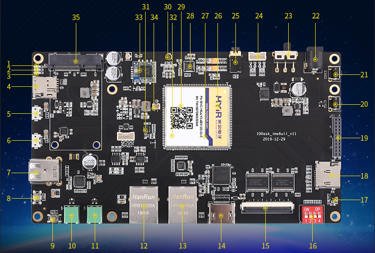
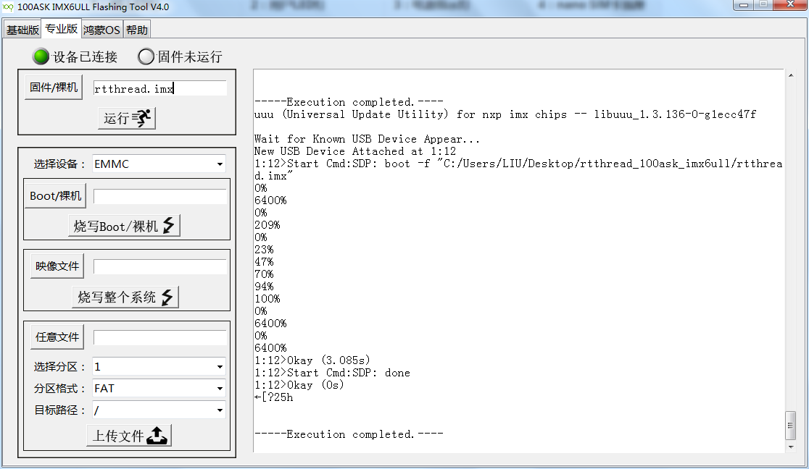

# i.MX6ULL 100ask

**板子靓照**

​      **板载资源说明：**

| 1：4G LED灯                | 2：用户LED灯             | 3：电源指示灯            | 4：nano SIM卡插座     |
| -------------------------- | ------------------------ | ------------------------ | --------------------- |
| 5：USB OTG(micro接口)      | 6: USB 转串口(micro接口) | 7: 2路USB HOST           | 8: KEY 1              |
| 9: KEY2                    | 10: RS485                | 11: CAN接口              | 12: 以太网接口1(RJ45) |
| 13: 以太网接口2(RJ45)      | 14: 板载HDMI接口         | 15: RGB TFT LCD接口      | 16: BOOT选择拨码开关  |
| 17: AP3216                 | 18: micro SD接口         | 19: Camera & 扩展IO      | 20: 复位按键 KEY4     |
| 21: 开/关机 KEY3           | 22: DC 6~12V电源输入     | 23: Power Switch         | 24: 喇叭输出          |
| 25: 4线耳麦接口            | 26: 512MB DDR3L          | 27: 4GB eMMC flash       | 28: wm8960            |
| 29: NXP IMX6ULL            | 30: MIC1(咪头)           | 31: 六轴（IC268G）       | 32: LAN PHY芯片       |
| 33: 板载WIFI/BT芯片RTL8723 | 34: RTC后备电池接口      | 35: mini PCIE 4G模块接口 |                       |

编译

`env`环境下直接`scons`编译

下载

使用韦东山老师的下载工具下载`rtthread.imx`文件，非常方便。

